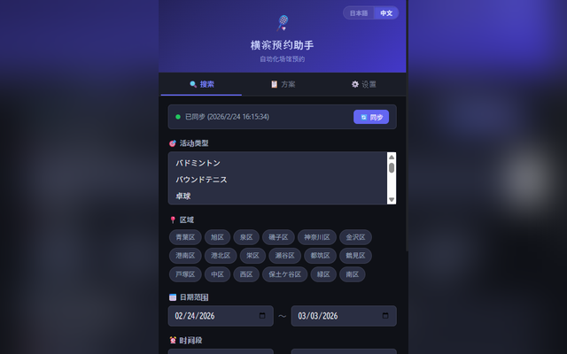
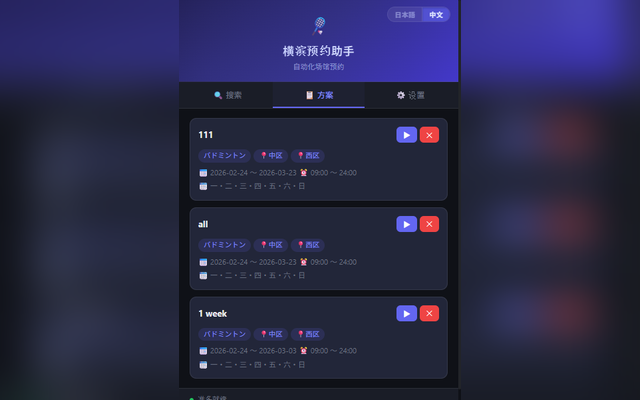
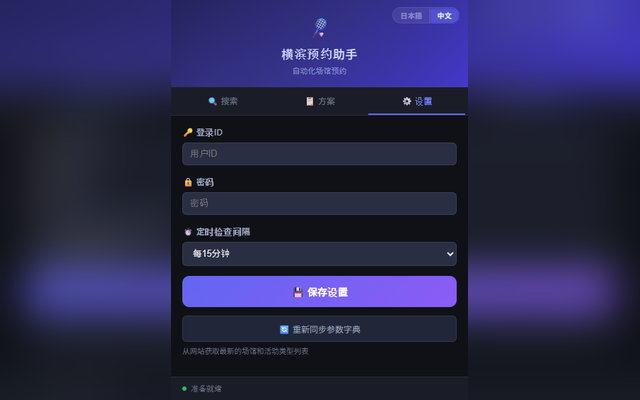

# 横滨设施预约助手 (Yokohama Facility Booking Assistant)

Chrome 浏览器扩展程序 - 自动在横滨市市民利用设施预约系统上进行场地搜索和预订的辅助工具。

## 📸 界面截图

### 主界面（搜索条件设置）



### 方案/结果相关界面



### 设置界面



## 📁 项目结构

```
Badminton-YoYaku/
├── manifest.json        # Chrome 扩展程序清单 (V3)
├── background.js        # Service Worker（后台处理核心）
├── content.js           # 自动化引擎（页面 DOM 操作）
├── popup.html           # 弹出窗口 UI
├── popup.css            # 弹出窗口样式
├── popup.js             # 弹出窗口逻辑
├── i18n.js              # 国际化多语言支持模块 (中/日文切换)
├── icons/               # 扩展程序图标目录
│   ├── icon16.png
│   ├── icon48.png
│   └── icon128.png
└── README.md            # 项目说明文档
```

## 🚀 安装方法

### 1. 在 Chrome 浏览器中安装

1. 打开 Google Chrome 浏览器
2. 在地址栏输入 `chrome://extensions/` 并回车
3. 打开右上角的 **“开发者模式”** 开关
4. 点击左上角的 **“加载已解压的扩展程序”** 按钮
5. 在弹出的文件夹选择对话框中，选择 `C:\Local\test\Badminton-YoYaku`（或存放本扩展的文件夹）
6. 如果列表中出现了 **“横浜施設予約アシスタント”**（横滨设施预约助手），则安装成功！

### 2. 在 Edge 浏览器中安装（备用方案）

1. 打开 Microsoft Edge 浏览器
2. 在地址栏输入 `edge://extensions/` 并回车
3. 打开左下角的 **“开发人员模式”** 开关
4. 点击右上角的 **“加载解压缩的扩展”** 按钮
5. 同样选择存放本扩展的文件夹即可

## 📖 使用说明

### 第一步: 同步参数字典（仅首次需要）

1. 点击浏览器工具栏上的扩展程序图标（带“Y”字的图标）打开面板
2. 点击 **“🔄 同步”** 按钮
3. 扩展程序会在后台悄悄打开预约网站，自动抓取最新的“使用目的”和“区域（区）”列表
4. 完成后，状态会显示为“参数字典已更新”

### 第二步: 设置搜索条件

1. **利用目的 (活动类型)**: 从下拉列表中选择（例如：羽毛球、网球）。在 Windows 下按住 Ctrl 键并点击可以多选。
2. **区域 (区)**: 点击对应区的标签来选择想要搜索的区域（可多选）。
3. **日期范围**: 设置你想搜索的开始日期和结束日期。
4. **时间段**: 设置你希望场地空闲的时间段（例如 09:00 ～ 12:00）。
5. **星期过滤**: 勾选你想要搜索的星期几（默认全选）。

### 第三步: 一键搜索

点击底部的 **“🚀 一键搜索（后台运行）”** 按钮：
- 扩展程序会在后台新建一个标签页
- 自动帮你填写搜索条件、翻页、查找空闲时间段
- **这期间你完全可以在其他标签页做别的事情，互不影响**
- 如果找到空位，会在电脑右下角弹出版面通知（包含设施名称、空位数等）

### 第四步: 保存方案

如果你经常搜索同样的条件，可以把它存为“方案”：
1. 设定好各项搜索条件
2. 点击 **“💾 将当前条件保存为方案”** 按钮
3. 输入方案名称（例如“周末保土谷羽毛球”）
4. 之后你可以在 **“📋 方案”** 标签页中，一键点击 ▶ 直接运行这个方案

### 第五步: 设置 (可选)

**⚙️ 设置标签页:**
- **登录账号/密码**: 用于搜索结束且找到空位后自动帮你填入登录信息。
- **定时后台检查**: 可以设置“每 15 分钟/30 分钟/1 小时”自动在后台执行一次搜索。

## ⚠️ 注意事项

- 初次安装后，请务必先点击一次“同步参数字典”。
- 如果开启了“定时后台检查”功能，请保持 Chrome 浏览器处于运行状态。
- 您填写的账号密码仅保存在浏览器的本地存储（Local Storage）中，不会上传到任何服务器（未加密存储）。
- 如果由于预约网站官方更改了网页结构导致扩展程序报错，请尝试在设置页点击“重新同步参数字典”，或者联系开发者更新代码。

## 🛠️ 疑难解答

| 问题现象 | 解决方法 |
|----------|----------|
| 参数字典同步一直失败 | 可能是官方网站在维护。请打开新标签页，手动检查横滨市预约网站是否能正常访问。 |
| 搜索跑到一半卡住了 | 在 Chrome 扩展程序管理页 (`chrome://extensions/`) 点击本插件的“🔄 刷新”按钮重新加载。 |
| 一直提示“未找到空位” | 请尝试将日期范围、时间段、星期几放宽，以增加搜索命中率。 |
| 找到了空位但没有桌面通知 | 请检查 Windows 系统的“通知和操作”设置，确保 Chrome 浏览器的通知权限是开启的。 |
