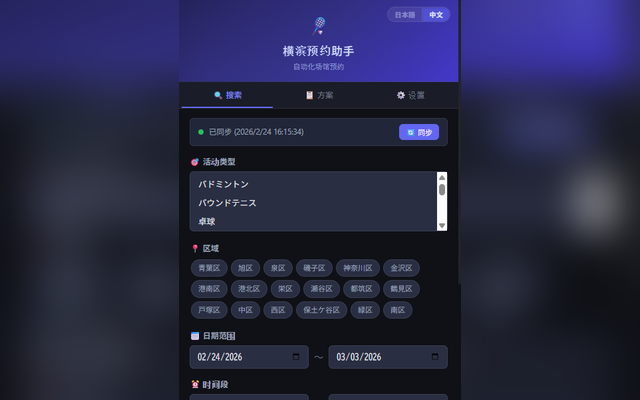
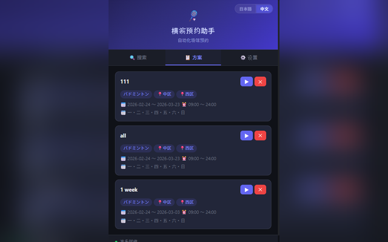
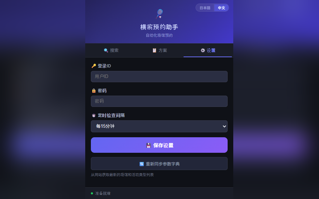

# Badminton YoYaku

<div align="center">
  
  <h3>横浜施設予約アシスタント</h3>
  <p>
    一个因为羽毛球爱好和真实使用场景而写出来的浏览器扩展。<br />
    它不试图“接管预约”，而是把横滨市民利用设施预约系统里重复、机械、低效的空位检索流程压缩成
    <strong>一次配置 + 后台巡检 + 有空位时通知我</strong>。
  </p>
  <p>
    <a href="https://chromewebstore.google.com/detail/%E6%A8%AA%E6%B5%9C%E6%96%BD%E8%A8%AD%E4%BA%88%E7%B4%84%E3%82%A2%E3%82%B7%E3%82%B9%E3%82%BF%E3%83%B3%E3%83%88/knhnnfllghnlgajgmahpokfghlnlbdod">Chrome Web Store</a>
    ·
    <a href="https://www.shisetsu.city.yokohama.lg.jp/user/Home">目标网站</a>
    ·
    <a href="#快速开始">本地体验</a>
    ·
    <a href="./PRIVACY_POLICY.md">隐私政策</a>
    ·
    <a href="./TERMS_OF_SERVICE.md">使用条款</a>
  </p>
  <p>
    
    
    
    
    
    
    
  </p>
</div>

## 页面预览

<p align="center">
  
  
  
</p>

## 这是什么

`Badminton YoYaku` 是一个面向横滨市市民利用设施预约系统的 Chrome / Edge 扩展。

它的目标很明确: 不是做一个夸张的“全自动抢位机器人”，而是把真实使用中最浪费时间的部分自动化掉，比如反复勾选利用目的、区域、日期范围、时间段、星期过滤，或者定时刷新空位结果。  
当真正出现空位时，用户再回到页面继续判断和操作。

这也是这个项目的核心想法:

- 从个人兴趣出发: 因为会实际用它去看羽毛球等场馆空位，所以优先解决“自己每天真的会遇到的重复问题”。
- 保持人类在回路中: 扩展负责检索、筛选、巡检和提醒，不越界成黑盒式的全流程代办。
- 本地优先: 不依赖第三方服务器，不上传账号、方案和搜索条件，降低隐私风险，也让项目更轻、更可控。
- 站点定制而不是泛化平台: 直接围绕横滨官方预约系统的 DOM 和流程设计，优先换来实用性，而不是抽象上的“通用”。

## 适用场景

- 你经常在横滨市预约羽毛球、网球或其他体育设施，经常要反复刷空位。
- 你有固定的区域、时间段、星期偏好，希望把它们保存成可复用的方案。
- 你不想把账号或使用习惯交给第三方服务，只想让工具在本地浏览器里工作。
- 你希望在有空位时收到通知，而不是一直盯着官方页面手动刷新。

## 体验入口

- `Chrome 安装`: [Chrome Web Store - 横浜施設予約アシスタント](https://chromewebstore.google.com/detail/%E6%A8%AA%E6%B5%9C%E6%96%BD%E8%A8%AD%E4%BA%88%E7%B4%84%E3%82%A2%E3%82%B7%E3%82%B9%E3%82%BF%E3%83%B3%E3%83%88/knhnnfllghnlgajgmahpokfghlnlbdod)
- `目标网站`: [横滨市市民利用设施预约系统](https://www.shisetsu.city.yokohama.lg.jp/user/Home)
- `本地体验`: 按下方步骤以开发者模式加载扩展
- `说明`: 这个项目没有脱离目标网站的独立在线 Demo，因为它的核心能力依赖浏览器扩展、页面自动化和官方站点 DOM

## 功能概览

- 后台一键搜索: 自动打开目标站点、填写条件并执行空位检索。
- 参数字典同步: 从官网同步最新的利用目的与区域列表，避免手写配置。
- 方案保存与复用: 将常用搜索条件保存成 profile，一键复跑。
- 方案编辑: 支持回填已保存方案并覆盖更新。
- 记忆上次搜索: 下次打开弹窗时自动回填最近一次搜索条件。
- 定时检查: 支持按 15 / 30 / 60 分钟周期巡检启用中的方案。
- 空位通知: 发现可用场地后推送桌面通知，并把对应页面保留给用户进一步处理。
- 双语界面: 内置中文 / 日文切换。
- 本地登录信息辅助: 可选保存登录信息，仅用于本地自动填充登录页。

## 技术实现

这个项目是一个典型的 Manifest V3 浏览器扩展，采用原生 HTML / CSS / JavaScript 编写，没有引入额外构建链。

| 模块 | 主要文件 | 职责 |
| --- | --- | --- |
| Popup UI | `popup.html`, `popup.css`, `popup.js`, `i18n.js` | 配置搜索条件、管理方案、设置语言与状态反馈 |
| Service Worker | `background.js` | 负责任务调度、定时器、通知、搜索状态广播 |
| Content Script | `content.js` | 注入目标站点，执行表单填写、页面跳转、结果解析与高亮 |
| Local Storage | `chrome.storage.local` | 保存方案、字典、最近搜索条件、语言与设置 |

几个关键的工程取舍:

- `Local-first`: 不需要自建后端，也不引入额外的数据同步链路。
- `DOM-driven automation`: 直接对目标网站页面做步骤识别和元素操作，换来零部署成本，但也意味着官网改版后需要跟进适配。
- `Human-in-the-loop`: 工具自动检索和提醒，但把最终判断留给使用者，避免过度自动化带来的不透明和不可控。

## 快速开始

### 方式一: 从 Chrome Web Store 安装

1. 打开 [Chrome Web Store - 横浜施設予約アシスタント](https://chromewebstore.google.com/detail/%E6%A8%AA%E6%B5%9C%E6%96%BD%E8%A8%AD%E4%BA%88%E7%B4%84%E3%82%A2%E3%82%B7%E3%82%B9%E3%82%BF%E3%83%B3%E3%83%88/knhnnfllghnlgajgmahpokfghlnlbdod)。
2. 安装扩展，并固定到浏览器工具栏。
3. 打开扩展弹窗，先执行一次“同步”，拉取官网的最新利用目的和区域参数。

### 方式二: 开发者模式加载

1. 克隆仓库到本地。
2. 打开 `chrome://extensions/` 或 `edge://extensions/`。
3. 开启开发者模式。
4. 点击“加载已解压的扩展程序”。
5. 选择当前项目目录 `Badminton-YoYaku`。
6. 打开扩展弹窗，先执行一次“同步”，拉取官网的最新利用目的和区域参数。

## 典型使用流程

1. 在搜索页选择利用目的、区域、搜索周期、时间段和星期过滤。
2. 如有需要，在设置页填写登录 ID、密码，以及定时检查间隔。
3. 点击“后台搜索”，由扩展自动打开目标网站并执行检索。
4. 如果这是一组常用条件，保存为方案。
5. 对常用方案开启定时巡检。
6. 当系统通知有空位时，再回到页面查看和继续操作。

## 权限与隐私

| 权限 | 用途 |
| --- | --- |
| `storage` | 保存本地设置、搜索方案、最近搜索条件、参数字典 |
| `scripting` | 向目标页面注入脚本以执行同步和自动化流程 |
| `alarms` | 执行周期性定时检查 |
| `notifications` | 在发现空位时发送系统通知 |
| `host_permissions` | 仅访问 `https://www.shisetsu.city.yokohama.lg.jp/*` |

隐私策略也很直接:

- 所有数据默认只保存在浏览器本地。
- 不依赖第三方服务器。
- 不主动上传用户的账号、密码、方案或使用记录。

## 项目结构

```text
badminton-yoyaku/
├── manifest.json
├── background.js
├── content.js
├── popup.html
├── popup.css
├── popup.js
├── i18n.js
├── icons/
├── capture/
├── README.md
├── PRIVACY_POLICY.md
├── TERMS_OF_SERVICE.md
└── STORE_DESCRIPTION.md
```

## 边界与说明

- 这是一个第三方个人项目，与横滨市政府及官方预约系统没有隶属关系。
- 项目当前聚焦“空位检索辅助”，不承诺替代官方完整预约流程。
- 扩展的稳定性依赖目标网站 DOM；若官网改版，选择器和流程可能需要调整。
- 请遵守官方平台规则，合理、克制地使用自动化能力。

## 相关文档

- [隐私政策](./PRIVACY_POLICY.md)
- [使用条款](./TERMS_OF_SERVICE.md)
- [商店文案](./STORE_DESCRIPTION.md)

---

如果你也在做这种“从真实生活摩擦里长出来的小工具”，这个项目大概会很容易理解:  
不是为了展示复杂架构，而是为了把自己会一遍遍做的事情，认真地自动化一次。
