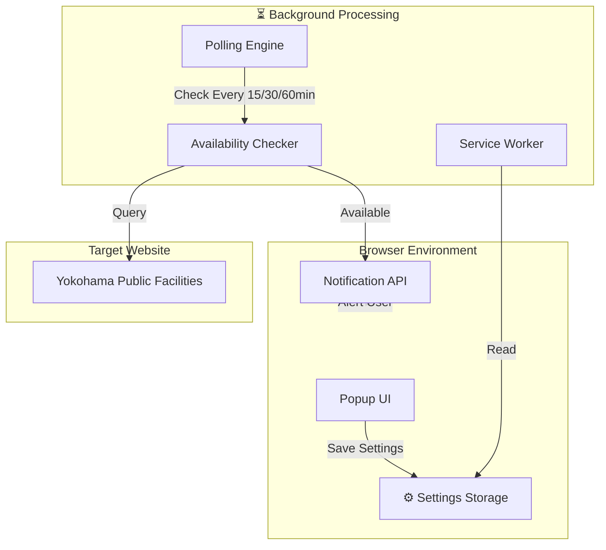

[English](README.md) | [中文](README_CN.md)

<div align="center">


</div>

I'm **Bojiang**, a badminton enthusiast in Yokohama, Japan. Organizing group badminton sessions requires booking public facilities, which can be tedious with manual searches. **badminton-yoyaku** is a Chrome/Edge browser extension that automates facility booking checks for Yokohama's public sports centers.

---

## 📋 Overview

**badminton-yoyaku** simplifies Yokohama facility reservations through intelligent automation. Set your preferences once, and let the extension monitor availability—you get notified when courts become available, then confirm bookings manually.

### Key Features

| Feature | Details |
|---------|---------|
| 🔍 **Background Polling** | Auto-checks facility availability in the background |
| 📅 **Saved Searches** | Store your preferred facilities, times, dates |
| 🔔 **Desktop Notifications** | Instant alerts when courts become available |
| ⏱️ **Flexible Intervals** | Choose check frequency (15, 30, or 60 minutes) |
| 🇯🇵 **Bilingual UI** | Japanese & English interface |
| 🎯 **Manual Confirmation** | You control the final booking decision |
| ⚡ **Lightweight** | Minimal resource usage, no background drain |

---

## 🚀 Tech Stack

<div align="center">


</div>

**Platform**: Chrome & Edge browsers (Manifest V3)

**Architecture**: 
- Popup UI for settings
- Content Script for page interaction
- Service Worker for background polling
- Native Storage API for persistence

**Languages**: HTML5, CSS3, Vanilla JavaScript ES2023

---

## 📦 Architecture


```mermaid
graph TB
 subgraph Browser[" Browser Environment"]
 UI[" Popup UI"]
 Settings["⚙ Settings Storage"]
 Notifications[" Notification API"]
 end

 subgraph Background["⏳ Background Processing"]
 ServiceWorker[" Service Worker"]
 Polling[" Polling Engine"]
 Checker[" Availability Checker"]
 end

 subgraph Target[" Target Website"]
 YokohamaFacility["Yokohama Public Facilities"]
 end

 UI -->|Save Settings| Settings
 ServiceWorker -->|Read| Settings
 Polling -->|Check Every 15/30/60min| Checker
 Checker -->|Query| YokohamaFacility
 Checker -->|Available| Notifications
 Notifications -->|Alert User| Browser
```

---

## 🛠️ Installation

### From Chrome Web Store

1. Visit [Chrome Web Store](https://chrome.webstore.google.com)
2. Search for "badminton-yoyaku"
3. Click "Add to Chrome"
4. Grant permissions when prompted

### Manual Installation (Developer Mode)

```bash
# Clone repository
git clone https://github.com/hakupao/badminton-yoyaku.git
cd badminton-yoyaku

# No build step needed - pure vanilla JS
```

**Load in Chrome**:
1. Open `chrome://extensions/`
2. Enable "Developer mode" (top right)
3. Click "Load unpacked"
4. Select the `badminton-yoyaku` folder

---

## 📸 Screenshots

| Search Conditions | Search Results | Settings |
|:-----------------:|:--------------:|:--------:|
|  |  |  |

---

## 🎯 Usage Guide

### First Setup

1. **Open Extension Settings**
   - Click extension icon in browser toolbar
   - Click "Settings" tab

2. **Configure Facilities**
   - Select target facility (e.g., "Kanagawa Badminton Center")
   - Choose preferred time slots
   - Pick date range

3. **Set Polling Interval**
   - 15 minutes: Most frequent, higher resource usage
   - 30 minutes: Balanced (recommended)
   - 60 minutes: Minimum resource usage

4. **Enable Notifications**
   - Turn on "Desktop Notifications"
   - Allow permission when browser prompts

5. **Save Configuration**
   - Click "Save Settings"
   - Extension begins background monitoring

### Monitoring

- Extension runs quietly in background
- Check icon badge for last update time
- When availability found, desktop notification appears

### Booking

1. Click notification or extension icon
2. Extension opens facility booking page
3. Complete reservation manually (security measure)

---

## 📊 Settings Storage

All settings stored locally using Chrome Storage API:

```javascript
// Example stored configuration
{
  facilities: [
    {
      id: "kanagawa-center",
      name: "Kanagawa Badminton Center",
      courts: ["Court 1", "Court 2"]
    }
  ],
  dateRange: {
    start: "2025-04-04",
    end: "2025-04-15"
  },
  timeSlots: ["18:00-20:00", "20:00-22:00"],
  pollingInterval: 30,
  notificationsEnabled: true,
  lastChecked: "2025-04-04T14:30:00Z"
}
```

---

## 🔍 Content Scripts

The extension uses content scripts to interact with Yokohama facility websites:

```javascript
// service-worker.js - Background polling logic
chrome.alarms.create('checkAvailability', { periodInMinutes: pollingInterval });

chrome.alarms.onAlarm.addListener(async (alarm) => {
  if (alarm.name === 'checkAvailability') {
    const availability = await checkFacilityAvailability();
    if (availability.hasOpenSlots) {
      chrome.notifications.create({
        type: 'basic',
        title: 'Court Available!',
        message: `${availability.facility} has open slots`,
        iconUrl: '/images/icon-128.png'
      });
    }
  }
});
```

---

## 🌐 Bilingual Support

### Japanese (日本語)
- Complete UI in Japanese
- Japanese facility names
- Japanese date/time format

### English (English)
- Full English translation
- English facility names
- ISO date/time format

**Toggle Language**: Settings panel language selector

---

## 🔐 Privacy & Permissions

### Permissions Explained

| Permission | Purpose |
|-----------|---------|
| `activeTab` | Access current tab for booking |
| `scripting` | Run content scripts on facility sites |
| `notifications` | Desktop alerts for availability |
| `alarms` | Schedule background checks |
| `storage` | Save user settings locally |
| `host_permissions` | Query Yokohama facility websites |

### Data Privacy

- All settings stored **locally** on your device
- No data sent to external servers
- No tracking or analytics
- Open source - full transparency

---

## 🔄 How It Works

### 1. User Configuration
```
User sets facility preferences → Saved in local storage
```

### 2. Background Monitoring
```
Service Worker wakes every 15/30/60 minutes
→ Checks facility availability
→ Compares against saved preferences
```

### 3. Availability Detection
```
If match found:
→ Desktop notification sent
→ User can click to open booking page
```

### 4. Manual Booking
```
User completes reservation manually
(Prevents accidental bookings)
```

---

## 🛠️ Development

### Project Structure

```
badminton-yoyaku/
├── manifest.json
├── popup.html
├── popup.css
├── popup.js
├── service-worker.js
├── content.js
├── styles/
│   ├── dark.css
│   └── light.css
├── images/
│   ├── icon-16.png
│   ├── icon-48.png
│   ├── icon-128.png
│   └── icon-512.png
└── README.md
```

### Build & Test

```bash
# No build step required - pure vanilla JS

# Test locally:
# 1. Enable Developer mode in chrome://extensions
# 2. Load unpacked folder
# 3. Test on Yokohama facility websites
```

### Debug Mode

```javascript
// In popup.js or service-worker.js
const DEBUG = true;
if (DEBUG) {
  console.log('Extension state:', chrome.runtime.id);
}
```

---

## 📋 Supported Facilities

- Kanagawa Badminton Center
- Yokohama Sports Center
- District public facilities (varies by ward)
- Private courts (limited integration)

> Add more facilities by submitting pull requests!

---

## 🐛 Troubleshooting

### Notifications Not Working
- Check browser notification permissions
- Ensure "Desktop Notifications" enabled in settings
- Try different polling interval

### Settings Not Saving
- Clear browser cache: Settings → Privacy → Clear browsing data
- Reinstall extension

### Not Finding Available Courts
- Verify facility selection in settings
- Check date range covers today
- Confirm time slots match facility hours

---

## 📖 Related Projects

- **[badminton-tournament-v2](../badminton-tournament-v2)** - Tournament management system
- **[reserve_system](../reserve_system)** - Batch facility checker (Python alternative)
- **[shuttle-path](../shuttle-path)** - Coaching knowledge platform
- **[badminton_tournament_tool](../badminton_tournament_tool)** - Tournament tool v1

---

## 📝 Changelog

### v1.1.0 (Current)
- Bilingual UI support (日本語 & English)
- Improved notification timing
- Enhanced settings UI
- Dark mode support

### v1.0.0 (Initial)
- Background polling system
- Desktop notifications
- Settings persistence
- Basic facility support

---

## 🤝 Contributing

Contributions welcome! Areas needing help:

1. **More Facilities**: Add support for additional Yokohama facilities
2. **Regional Expansion**: Extend to other Japanese cities
3. **Translations**: Additional language support
4. **Features**: More scheduling options, calendar integration

---

## 📄 License

MIT License - See [LICENSE](LICENSE) file

---

## 💬 Contact & Support

- **GitHub**: [@hakupao](https://github.com/hakupao)
- **Issues**: [GitHub Issues](https://github.com/hakupao/badminton-yoyaku/issues)
- **Chrome Support**: [Chrome Web Store](https://chrome.webstore.google.com)

---

<div align="center">

**Automate your court bookings, focus on the game**


</div>
