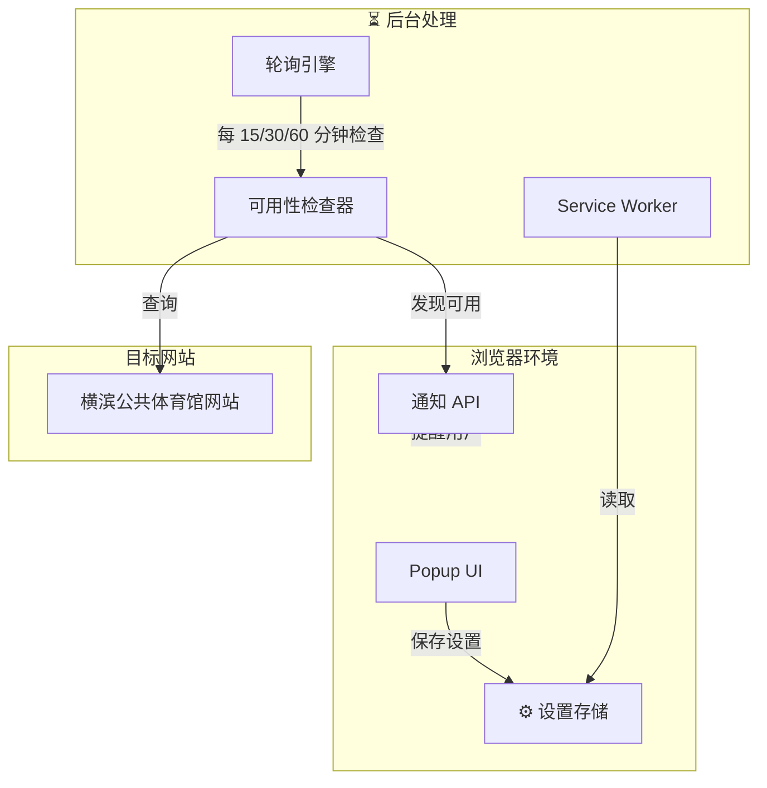

[English](README.md) | [中文](README_CN.md)

<div align="center">


</div>

我是 **Bojiang**，一名在横滨的羽毛球爱好者。组织团体羽毛球赛事需要预约公共体育设施，手工查询很繁琐。**badminton-yoyaku** 是一个 Chrome/Edge 浏览器扩展，自动检查横滨公共体育馆的羽毛球场地可用性。

---

## 📋 项目简介

**badminton-yoyaku** 通过智能自动化简化横滨体育馆预约。一次配置，扩展就在后台监控可用性——当有场地空出时收到通知，最后再手工确认预约。

### 核心功能

| 功能 | 说明 |
|------|------|
| 🔍 **后台轮询** | 自动检查设施可用性 |
| 📅 **保存搜索** | 存储常用设施、时段、日期 |
| 🔔 **桌面通知** | 场地可用时即时告警 |
| ⏱️ **灵活间隔** | 可选 15/30/60 分钟检查周期 |
| 🇯🇵 **双语界面** | 日文和英文支持 |
| 🎯 **手动确认** | 最终预约由用户控制 |
| ⚡ **轻量级** | 资源占用少，不影响浏览 |

---

## 🚀 技术栈

<div align="center">


</div>

**平台**: Chrome & Edge 浏览器（Manifest V3）

**架构**:
- Popup UI 用于设置
- Content Script 用于网页交互
- Service Worker 用于后台轮询
- 原生 Storage API 用于数据持久化

**语言**: HTML5、CSS3、原生 JavaScript ES2023

---

## 📦 架构设计



---

## 🛠️ 安装使用

### 从 Chrome 网上应用店安装

1. 访问 [Chrome 网上应用店](https://chrome.webstore.google.com)
2. 搜索 "badminton-yoyaku"
3. 点击"添加至 Chrome"
4. 授予权限

### 手动安装（开发者模式）

```bash
# 克隆仓库
git clone https://github.com/hakupao/badminton-yoyaku.git
cd badminton-yoyaku

# 无需构建 - 纯原生 JS
```

**在 Chrome 中加载**:
1. 打开 `chrome://extensions/`
2. 启用"开发者模式"（右上角）
3. 点击"加载未打包的扩展程序"
4. 选择 `badminton-yoyaku` 文件夹

---

## 🎯 使用指南

### 首次配置

1. **打开扩展设置**
   - 点击浏览器工具栏中的扩展图标
   - 点击"设置"标签

2. **配置设施**
   - 选择目标体育馆（如"神奈川羽毛球中心"）
   - 选择偏好的时间段
   - 选择日期范围

3. **设置轮询间隔**
   - 15 分钟：最频繁，资源占用较多
   - 30 分钟：均衡（推荐）
   - 60 分钟：最少资源占用

4. **启用通知**
   - 打开"桌面通知"
   - 浏览器提示时允许权限

5. **保存配置**
   - 点击"保存设置"
   - 扩展开始后台监控

### 监控中

- 扩展在后台静默运行
- 查看图标徽章了解最后更新时间
- 发现可用性时，发送桌面通知

### 预约

1. 点击通知或扩展图标
2. 扩展打开体育馆预约页面
3. 手工完成预约（安全措施）

---

## 📊 设置存储

所有设置使用 Chrome Storage API 本地保存：

```javascript
// 示例配置
{
  facilities: [
    {
      id: "kanagawa-center",
      name: "神奈川羽毛球中心",
      courts: ["第1号场", "第2号场"]
    }
  ],
  dateRange: {
    start: "2025-04-04",
    end: "2025-04-15"
  },
  timeSlots: ["18:00-20:00", "20:00-22:00"],
  pollingInterval: 30,
  notificationsEnabled: true,
  lastChecked: "2025-04-04T14:30:00Z"
}
```

---

## 🔍 Content Scripts

扩展使用 content script 与横滨体育馆网站交互：

```javascript
// service-worker.js - 后台轮询逻辑
chrome.alarms.create('checkAvailability', { periodInMinutes: pollingInterval });

chrome.alarms.onAlarm.addListener(async (alarm) => {
  if (alarm.name === 'checkAvailability') {
    const availability = await checkFacilityAvailability();
    if (availability.hasOpenSlots) {
      chrome.notifications.create({
        type: 'basic',
        title: '有场地可用！',
        message: `${availability.facility} 有空余场地`,
        iconUrl: '/images/icon-128.png'
      });
    }
  }
});
```

---

## 🌐 双语支持

### 日文（日本語）
- 完整的日文 UI
- 日文体育馆名称
- 日期时间日本格式

### 英文（English）
- 完整的英文翻译
- 英文体育馆名称
- ISO 日期时间格式

**切换语言**: 设置面板中的语言选择器

---

## 🔐 隐私与权限

### 权限说明

| 权限 | 用途 |
|------|------|
| `activeTab` | 访问当前标签用于预约 |
| `scripting` | 在体育馆网站运行脚本 |
| `notifications` | 发送可用性桌面通知 |
| `alarms` | 安排后台检查时间 |
| `storage` | 本地保存用户设置 |
| `host_permissions` | 查询横滨体育馆网站 |

### 数据隐私

- 所有设置**仅在本地**存储
- 不向外部服务器发送数据
- 无跟踪或分析
- 开源项目 - 完全透明

---

## 🔄 工作原理

### 1. 用户配置
```
用户设置体育馆偏好 → 保存到本地存储
```

### 2. 后台监控
```
Service Worker 每 15/30/60 分钟唤醒
→ 检查体育馆可用性
→ 与保存的偏好对比
```

### 3. 可用性检测
```
如果匹配：
→ 发送桌面通知
→ 用户可点击打开预约页面
```

### 4. 手工预约
```
用户手工完成预约
（防止意外预约）
```

---

## 🛠️ 开发

### 项目结构

```
badminton-yoyaku/
├── manifest.json
├── popup.html
├── popup.css
├── popup.js
├── service-worker.js
├── content.js
├── styles/
│   ├── dark.css
│   └── light.css
├── images/
│   ├── icon-16.png
│   ├── icon-48.png
│   ├── icon-128.png
│   └── icon-512.png
└── README.md
```

### 构建与测试

```bash
# 无需构建 - 纯原生 JS

# 本地测试：
# 1. 在 chrome://extensions 启用开发者模式
# 2. 加载未打包的文件夹
# 3. 在横滨体育馆网站测试
```

### 调试模式

```javascript
// 在 popup.js 或 service-worker.js
const DEBUG = true;
if (DEBUG) {
  console.log('Extension state:', chrome.runtime.id);
}
```

---

## 📋 支持的设施

- 神奈川羽毛球中心
- 横滨体育中心
- 各区公共设施（因区而异）
- 私人球馆（有限集成）

> 通过提交 PR 添加更多设施！

---

## 🐛 故障排除

### 通知无法工作
- 检查浏览器通知权限
- 确保设置中启用了"桌面通知"
- 尝试不同的轮询间隔

### 设置无法保存
- 清除浏览器缓存：设置 → 隐私 → 清除浏览数据
- 重新安装扩展

### 找不到可用场地
- 验证设置中的设施选择
- 检查日期范围是否包含今天
- 确认时间段与设施营业时间匹配

---

## 📖 相关项目

- **[badminton-tournament-v2](../badminton-tournament-v2)** - 赛事管理系统
- **[reserve_system](../reserve_system)** - 批量预约检查工具（Python）
- **[shuttle-path](../shuttle-path)** - 教学知识库平台
- **[badminton_tournament_tool](../badminton_tournament_tool)** - 赛事工具 v1

---

## 📝 更新日志

### v1.1.0（当前版本）
- 双语 UI 支持（日本語 & English）
- 改进通知时序
- 增强设置 UI
- 深色模式支持

### v1.0.0（初版）
- 后台轮询系统
- 桌面通知
- 设置持久化
- 基础设施支持

---

## 🤝 参与贡献

欢迎贡献代码！需要帮助的方面：

1. **更多设施**：支持更多横滨体育馆
2. **地区扩展**：支持其他日本城市
3. **翻译**：更多语言支持
4. **新功能**：日历集成、更多排程选项

---

## 📄 许可证

MIT 许可证 - 详见 [LICENSE](LICENSE) 文件

---

## 💬 联系与支持

- **GitHub**: [@hakupao](https://github.com/hakupao)
- **Issues**: [GitHub Issues](https://github.com/hakupao/badminton-yoyaku/issues)
- **Chrome 应用店**: [Chrome Web Store](https://chrome.webstore.google.com)

---

<div align="center">

**自动预约，专注比赛**


</div>
